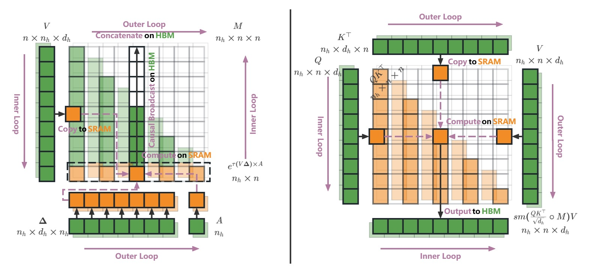

# Flash Dynamic Mask Attention



Flash-DMA is a high-performance attention implementation that integrates Flash Attention's memory efficiency with Dynamic Mask Attention's sparse computation capabilities for processing extremely long sequences in transformer models.

## Key Features

- **Sparse Attention Computation**: Dynamically selects the most important keys for each query, reducing computation from $O(N^2)$ to $O(N \cdot w)$ where $w \ll N$.
- **Memory Efficiency**: Maintains Flash Attention's $O(N)$ memory complexity without materializing the full attention matrix.
- **CUDA-Accelerated**: Deep integration at the CUDA kernel level with custom sparse GEMM operations for maximum performance.
- **Long Sequence Support**: Efficiently handles sequences of 128K+ tokens through dynamic masking when sequence length exceeds `keep_window_size`.
- **Advanced Integration**: Complete integration from Python frontend to CUDA backend with optimized memory layouts and sparse computation strategies.

## Installation

### Prerequisites

- **Python**: 3.8 or later
- **PyTorch**: 2.0.0 or later  
- **CUDA**: 11.8 or later
- **NVIDIA GPU**: Compute Capability 8.0 or higher
- **C++ Compiler**: GCC 7+

### CUDA Environment Setup

Ensure your CUDA environment is properly configured:

```bash
# Check CUDA installation
nvcc --version

# Set CUDA_HOME if needed
export CUDA_HOME=/usr/local/cuda
```

### Install from Source

```bash
git clone https://github.com/SmallDoges/flash-dmattn.git
cd flash-dmattn
git submodule update --init --recursive
pip install .
```

## Quick Start

```python
import torch
import flash_dma_cuda
import torch.nn.functional as F
import math

# Setup
batch_size, seq_len, num_heads, head_dim = 2, 4096, 12, 128
device = torch.device('cuda')
dtype = torch.bfloat16

# Input tensors
query = torch.randn(batch_size, seq_len, num_heads, head_dim, 
                   device=device, dtype=dtype)
key = torch.randn(batch_size, seq_len, num_heads, head_dim,
                 device=device, dtype=dtype)
value = torch.randn(batch_size, seq_len, num_heads, head_dim,
                   device=device, dtype=dtype)
zoh_states = torch.randn(batch_size, num_heads, seq_len, seq_len,
                            device=device, dtype=dtype)
active_mask = torch.ones(batch_size, num_heads, seq_len, seq_len,
                            device=device, dtype=dtype)

# Run Flash-DMA
output = flash_dma_cuda.fwd(
    q=query, k=key, v=value,
    zoh=zoh_states, active_mask=active_mask,
    softmax_scale=1.0/math.sqrt(head_dim),
    keep_window_size=keep_window_size,
    is_causal=True
)[0]

print(f"Output shape: {output.shape}")  # [2, 4096, 12, 128]
```


## How It Works

Flash-DMA combines two complementary techniques:

- **Dynamic Mask Attention**: Computes relevance scores for keys and selects only the most important ones for attention computation
- **Flash Attention**: Processes attention in blocks to reduce memory usage and HBM access

### The Integration Approach

The integration happens at the CUDA kernel level with several key components:

- **ZOH States**: Pre-computed importance scores for key selection
- **Active Masks**: Binary masks indicating which keys should be considered for each query
- **Sparse Matrix Multiplication**: Custom CUDA kernels for efficient sparse attention computation
- **Block-Based Processing**: Maintains Flash Attention's block-based approach for memory efficiency

This creates a hybrid attention mechanism that achieves both memory and computational efficiency for long sequences.


## Documentation

📚 **Complete documentation is available in the [docs](docs/) directory:**

- **[API Reference](docs/api_reference.md)** - Complete function documentation and usage examples
- **[Integration Guide](docs/integration.md)** - Detailed technical documentation of the Flash Attention integration


## Building from Source

### Development Setup

```bash
# Clone with submodules
git clone --recursive https://github.com/SmallDoges/flash-dmattn.git
cd flash-dmattn

# Build in development mode
pip install -e .

# Run tests to verify installation
python -c "import flash_dma_cpp; print('✅ Flash DMA CUDA extension imported successfully')"
```

### Build Requirements

- CUDA Toolkit 11.8+
- CUTLASS library
- PyTorch with CUDA support

### Supported Architectures

- **SM 8.0** 
- **SM 9.0**
- **SM 10.0**
- **SM 12.0**

**Note**: Flash Dynamic Mask Attention requires CUDA compute capability 8.0+ for optimal performance. Earlier architectures are not supported.

## Benchmarking

Flash-DMA provides comprehensive benchmarking tools to evaluate performance across different configurations:

### Forward Pass Equivalence
```bash
python benchmarks/benchmark_forward_equivalence.py
```
Validates numerical consistency between Python reference and CUDA implementation.

### Performance Benchmarking  
```bash
python benchmarks/benchmark_forward_performance.py
```
Compares Flash-DMA against standard Flash Attention across various sequence lengths and batch sizes.

### Gradient Computation
```bash
python benchmarks/benchmark_grad.py
```
Tests backward pass implementation and gradient equivalence.

### Multi-Query Associative Recall
```bash
python benchmarks/benchmark_mqar.py
```
Evaluates performance on long-range reasoning tasks.


## Troubleshooting

### Common Issues

**Compilation Errors**
```bash
# Ensure CUDA_HOME is set correctly
echo $CUDA_HOME  # Linux/Mac
echo $env:CUDA_HOME  # Windows PowerShell

# Check CUDA toolkit version
nvcc --version

# Verify PyTorch CUDA support
python -c "import torch; print(f'CUDA available: {torch.cuda.is_available()}')"
```

**Import Errors**
```python
# Test basic import
try:
    import flash_dma_cpp
    print("✅ Flash DMA CUDA extension imported successfully")
except ImportError as e:
    print(f"❌ Import failed: {e}")
    print("Please ensure the package is properly installed with: pip install -e .")
```

**Performance Issues**
- Ensure GPU has compute capability 8.0+ for optimal performance
- Use `torch.bfloat16` for better numerical stability
- Adjust `keep_window_size` based on available GPU memory
- Verify CUDA kernels are being used

**Memory Issues**
```python
# Monitor GPU memory usage
torch.cuda.memory_summary()
torch.cuda.max_memory_allocated()

# Clear cache if needed
torch.cuda.empty_cache()
```

**Numerical Issues**
- Use `torch.bfloat16` instead of `torch.float16` for better stability
- Check input tensor ranges for NaN or infinite values
- Validate ZOH states and active mask values are in expected ranges

## License

This project is licensed under the BSD 3-Clause License. See [LICENSE](LICENSE) for details.

## Citation

If you use Flash-DMA in your research, please cite:

```bibtex
@misc{flash_dma_2025,
  title={Trainable Dynamic Mask Sparse Attention},
  author={Jingze Shi and Yifan Wu and Bingheng Wu and Yiran Peng and Yuyu Luo},
  year={2025},
  url={https://github.com/SmallDoges/flash-dmattn}
}
```

## Acknowledgments

This project builds upon and integrates several excellent works:

- **[Flash-Attention](https://github.com/Dao-AILab/flash-attention)** - Memory-efficient attention computation
- **[NVIDIA CUTLASS](https://github.com/NVIDIA/cutlass)** - High-performance matrix operations library

We thank the open-source community for their contributions to efficient transformer implementations.
