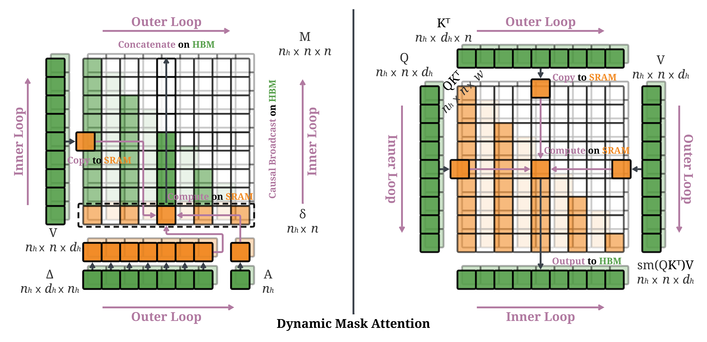
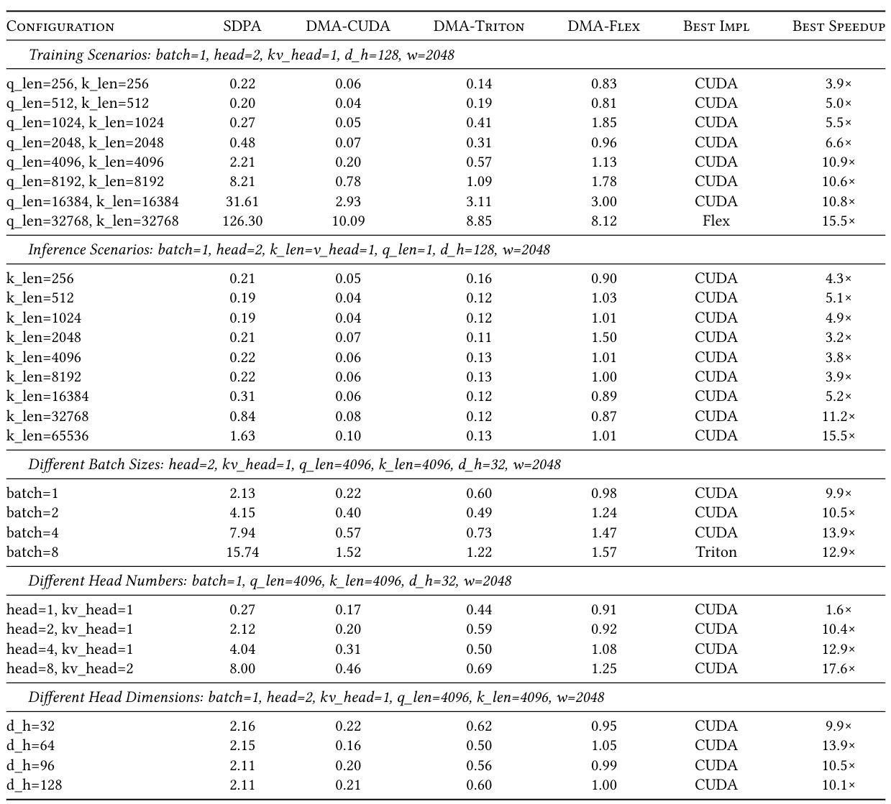

<div align="center">
  
</div>

<div align="center">


**English** | [简体中文](./README_zh.md)

</div>

**Trainable Dynamic Mask Sparse Attention**

> Jingze Shi, Yifan Wu, Bingheng Wu, Yiran Peng, Liangdong Wang, Guang Liu, Yuyu Luo

> Paper: https://huggingface.co/papers/2508.02124



Flash-DMA is a high-performance attention implementation that integrates Flash Attention's memory efficiency with Dynamic Mask Attention's sparse computation capabilities for processing extremely long sequences in transformer models.


## Key Features

- **Sparse Attention Computation**: Dynamically selects the most important keys for each query, reducing computation from $O(N^2)$ to $O(N \cdot w)$ where $w \ll N$.
- **Memory Efficiency**: Maintains Flash Attention's $O(N)$ memory complexity without materializing the full attention matrix.
- **CUDA-Accelerated**: Deep integration at the CUDA kernel level with custom sparse GEMM operations for maximum performance.
- **Long Sequence Support**: Efficiently handles sequences of 128K+ tokens through dynamic masking when sequence length exceeds `keep_window_size`.
- **Advanced Integration**: Complete integration from Python frontend to CUDA backend with optimized memory layouts and sparse computation strategies.


## Performance

We present expected speedup of Flash-DMA over standard PyTorch SDPA.




## Installation

### Prerequisites

- **Python**: 3.8 or later
- **PyTorch**: 2.0.0 or later  
- **CUDA**: 11.8 or later
- **NVIDIA GPU**: Compute Capability 8.0 or higher
- **C++ Compiler**: GCC 7+

### CUDA Environment Setup

Ensure your CUDA environment is properly configured:

```bash
# Check CUDA installation
nvcc --version

# Set CUDA_HOME if needed
export CUDA_HOME=/usr/local/cuda
```

### Install from Source

```bash
git clone https://github.com/SmallDoges/flash-dmattn.git
cd flash-dmattn
git submodule update --init --recursive
pip install .
```


## Quick Start

```python
import torch
from flash_dmattn import flash_dmattn_func_auto
import math

# Setup
batch_size, seq_len, num_heads, head_dim = 2, 4096, 16, 128
device = torch.device('cuda')
dtype = torch.bfloat16

# Input tensors
query = torch.randn(batch_size, seq_len, num_heads, head_dim, 
                   device=device, dtype=dtype)
key = torch.randn(batch_size, seq_len, num_heads, head_dim,
                 device=device, dtype=dtype)
value = torch.randn(batch_size, seq_len, num_heads, head_dim,
                   device=device, dtype=dtype)

# Create mask and bias for sparse attention
attention_bias = torch.randn(batch_size, num_heads, seq_len, seq_len,
                           device=device, dtype=dtype)
attention_mask = torch.ones(batch_size, num_heads, seq_len, seq_len,
                          device=device, dtype=dtype)

# Apply dynamic masking (keep top-k for long sequences)
keep_window_size = 2048
if seq_len > keep_window_size:
    # Select top-k most important keys for each query
    topk_indices = torch.topk(attention_bias, keep_window_size, dim=-1, 
                             largest=True, sorted=False).indices
    attention_mask.zero_()
    attention_mask.scatter(-1, topk_indices, 1.0)

# Select backend
flash_dmattn_func = flash_dmattn_func_auto(backend="cuda")

# Run Flash Dynamic Mask Attention
output = flash_dmattn_func(
    q=query,
    k=key, 
    v=value,
    attn_mask=attention_mask,
    attn_bias=attention_bias,
    is_causal=True,
    scale=1.0/math.sqrt(head_dim),
)

print(f"Output shape: {output.shape}")  # [2, 4096, 16, 128]
```


## How It Works

Flash-DMA combines two complementary techniques:

- **Dynamic Mask Attention**: Computes relevance scores for keys and selects only the most important ones for attention computation
- **Flash Attention**: Processes attention in blocks to reduce memory usage and HBM access

### The Integration Approach

The integration happens at the CUDA kernel level with several key components:

- **ZOH States**: Pre-computed importance scores for key selection
- **Active Masks**: Binary masks indicating which keys should be considered for each query
- **Sparse Matrix Multiplication**: Custom CUDA kernels for efficient sparse attention computation
- **Block-Based Processing**: Maintains Flash Attention's block-based approach for memory efficiency

This creates a hybrid attention mechanism that achieves both memory and computational efficiency for long sequences.


## Documentation

📚 **Complete documentation is available in the [docs](docs/) directory:**

- **[API Reference](docs/api_reference.md)** - Complete function documentation and usage examples
- **[Integration Guide](docs/integration.md)** - Detailed technical documentation of the Flash Attention integration


## Building from Source

### Development Setup

```bash
# Clone with submodules
git clone --recursive https://github.com/SmallDoges/flash-dmattn.git
cd flash-dmattn

# Build in development mode
pip install -e .

# Run tests to verify installation
python -c "import flash_dma_cuda; print('✅ Flash DMA CUDA extension imported successfully')"
```

### Build Requirements

- CUDA Toolkit 11.8+
- CUTLASS library
- PyTorch with CUDA support

### Supported Architectures

- **SM 8.0** 
- **SM 9.0**
- **SM 10.0**
- **SM 12.0**

**Note**: Flash Dynamic Mask Attention requires CUDA compute capability 8.0+ for optimal performance. Earlier architectures are not supported.


## Benchmarking

Flash-DMA provides comprehensive benchmarking tools to evaluate performance across different configurations:

### Forward Pass Equivalence
```bash
python benchmarks/forward_equivalence.py
```
Validates numerical consistency between Python reference and CUDA implementation.

### Performance Benchmarking  
```bash
python benchmarks/forward_performance.py
```
Compares Flash-DMA against standard SDPA across various sequence lengths and batch sizes.

### Gradient Computation
```bash
python benchmarks/grad_equivalence.py
```
Tests backward pass implementation and gradient equivalence.


## Troubleshooting

### Common Issues

**Compilation Errors**
```bash
# Ensure CUDA_HOME is set correctly
echo $CUDA_HOME  # Linux/Mac
echo $env:CUDA_HOME  # Windows PowerShell

# Check CUDA toolkit version
nvcc --version

# Verify PyTorch CUDA support
python -c "import torch; print(f'CUDA available: {torch.cuda.is_available()}')"
```

**Import Errors**
```python
# Test basic import
try:
    from flash_dmattn import flash_dmattn_func, get_available_backends
    print("✅ Flash Dynamic Mask Attention imported successfully")
    print(f"Available backends: {get_available_backends()}")
except ImportError as e:
    print(f"❌ Import failed: {e}")
    print("Please ensure the package is properly installed with: pip install -e .")
```

**Performance Issues**
```python
# Monitor GPU memory usage
from flash_dmattn import flash_dmattn_func

def print_memory_stats():
    if torch.cuda.is_available():
        print(f"GPU Memory: {torch.cuda.memory_allocated() / 1e9:.2f} GB")

print_memory_stats()
output = flash_dmattn_func(q=query, k=key, v=value, is_causal=True)
print_memory_stats()

# Clear cache if needed
torch.cuda.empty_cache()
```


## Contributing

We welcome contributions from the community! Flash-DMA is an open-source project and we value all types of contributions.

### How to Contribute

- **Report bugs**: Found a bug? Please [open an issue](https://github.com/SmallDoges/flash-dmattn/issues/new/choose)
- **Request features**: Have an idea for improvement? [Let us know](https://github.com/SmallDoges/flash-dmattn/issues/new/choose)
- **Submit code**: Ready to contribute code? Check our [Contributing Guide](CONTRIBUTING.md)
- **Improve docs**: Help us make the documentation better

### Quick Start for Contributors

1. Fork the repository
2. Create a feature branch: `git checkout -b feature-name`
3. Make your changes and test them
4. Submit a pull request

For detailed instructions, see our [Contributing Guide](CONTRIBUTING.md).

### Code of Conduct

This project follows the [Contributor Covenant Code of Conduct](CODE_OF_CONDUCT.md). By participating, you are expected to uphold this code.


## License

This project is licensed under the BSD 3-Clause License. See [LICENSE](LICENSE) for details.


## Citation

If you use Flash-DMA in your research, please cite:

```bibtex
@misc{shi2025trainabledynamicmasksparse,
      title={Trainable Dynamic Mask Sparse Attention}, 
      author={Jingze Shi and Yifan Wu and Bingheng Wu and Yiran Peng and Liangdong Wang and Guang Liu and Yuyu Luo},
      year={2025},
      eprint={2508.02124},
      archivePrefix={arXiv},
      primaryClass={cs.AI},
      url={https://arxiv.org/abs/2508.02124}, 
}
```


## Acknowledgments

This project builds upon and integrates several excellent works:

- **[OpenSeek](https://github.com/FlagAI-Open/OpenSeek)** - Kernel development support
- **[Flash-Attention](https://github.com/Dao-AILab/flash-attention)** - Memory-efficient attention computation
- **[NVIDIA CUTLASS](https://github.com/NVIDIA/cutlass)** - High-performance matrix operations library

We thank the open-source community for their contributions to efficient transformer implementations. 🤗
