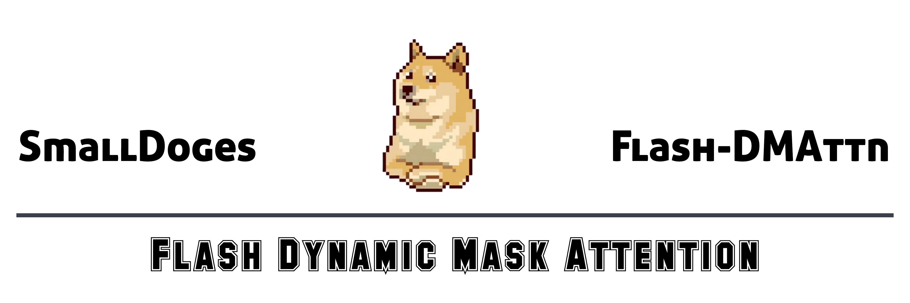
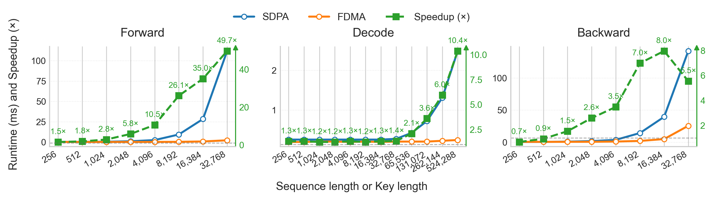

<!-- <div align="center">
  
</div> -->

<div align="center">


[English](./README.md) | **简体中文**

</div>


Flash-Sparse-Attention 是一个高性能的可训练稀疏注意力实现, 将 Flash Attention 的内存效率与动态掩码注意力的稀疏计算能力相结合, 用于在 Transformer 模型中处理超长序列. 


## 为什么选择 Flash-Sparse-Attention

在大规模 Transformer 的训练与推理中, 注意力的主要瓶颈并不相同:

- 训练侧的算力瓶颈: 全注意力的计算复杂度随着序列长度呈二次方增长, 且反向传播需重复同级别计算, 海量算力消耗在贡献极低的键值对上.
- 推理侧的访存瓶颈: 全注意力需要反复读写 Q, K, V 与中间变量, 对 KV-cache 的访存成为计算流程的主导, 算力难以被充分利用.

因此, 一个更正确的方向是稀疏注意力: 对每个查询仅与 $w$ 个最相关键交互, 把计算与访存从 $O(N^2)$ 降到 $O(N\cdot w)$，其中 $w\ll N$. 若稀疏模式能随任务自适应, 就有机会既快又准, 同时解决训练与推理的瓶颈, 具体请参考论文 [Trainable Dynamic Mask Sparse Attention](https://arxiv.org/abs/2508.02124).


## 主要特性

### 支持的功能

- 带有因果掩码的前向传播和反向传播
- 任意 Q 和 KV 序列长度
- 任意头数和小于等于256的头维度
- 分组查询注意力和多查询注意力
- 灵活的掩码与偏置
- 跳过掩码区域的访存与计算
- 偏置的梯度计算

### 我们想要支持的功能

- 分页注意力
- TMA, WGMMA 和 FP8 低精度
- 序列并行
- 进一步提升跳过访存与计算的性能


## 安装

### 依赖

- **Linux**: Ubuntu 22.04 或更高版本
- **NVIDIA GPU**: 计算能力 8.0 或更高
- **C++ 编译器**: GCC 7+
- **CUDA**: 11.8 或更高版本
- **Python**: 3.9 或更高版本
- **PyTorch**: 2.5.1 或更高版本  

### 安装

您可以通过预编译的轮子安装 FSA：

```bash
pip install flash-sparse-attn --no-build-isolation
```

或者, 您可以从源代码编译和安装：

```bash
git clone https://github.com/flash-algo/flash-sparse-attn.git
cd flash-sparse-attn
pip install . --no-build-isolation
```


## 快速开始

### 基本用法

```python
import torch
from flash_sparse_attn import flash_sparse_attn_func_auto
from flash_sparse_attn.utils.mask import create_mask
import math

# 设置
batch_size, seq_len, num_heads, num_kv_heads, head_dim = 1, 256, 2, 1, 64
window_size = 128
device = torch.device('cuda')
dtype = torch.bfloat16
min_dtype = torch.finfo(dtype).min  # dtype 的最小值

# 输入张量
query = torch.randn(batch_size, seq_len, num_heads, head_dim, device=device, dtype=dtype)
key = torch.randn(batch_size, seq_len, num_kv_heads, head_dim, device=device, dtype=dtype)
value = torch.randn(batch_size, seq_len, num_kv_heads, head_dim, device=device, dtype=dtype)

# 为稀疏注意力创建 bias
attn_bias = torch.randn(batch_size, num_kv_heads, 1, seq_len, device=device, dtype=dtype)

# 基于 bias 生成动态 mask
if seq_len > window_size:
    attn_mask = create_mask(
        attention_bias=attn_bias,
        attention_mask=None,
        batch_size=batch_size,
        query_len=seq_len,
        key_len=seq_len,
        window_size=window_size,
        min_dtype=min_dtype,
    )

# 选择 FSA 内核
flash_sparse_attn_func = flash_sparse_attn_func_auto(backend="cuda")

# 运行 FSA
output = flash_sparse_attn_func(
    query=query,
    key=key, 
    value=value,
    attn_mask=attn_mask,
    attn_bias=attn_bias,
    is_causal=True,
    softmax_scale=1.0/math.sqrt(head_dim),
)

print(f"输出形状: {output.shape}")  # [1, 256, 2, 64]
```

### 梯度计算示例

```python
# 开启梯度计算
query.requires_grad_(True)
key.requires_grad_(True)
value.requires_grad_(True)
attn_bias.requires_grad_(True)

# 前向传播
output = flash_sparse_attn_func(
    query=query, key=key, value=value,
    attn_mask=attn_mask,
    attn_bias=attn_bias,
    is_causal=True,
    softmax_scale=1.0/math.sqrt(head_dim)
)

# 反向传播
loss = output.sum()
loss.backward()

print(f"Query 梯度形状: {query.grad.shape}")
print(f"Key 梯度形状: {key.grad.shape}")
print(f"Value 梯度形状: {value.grad.shape}")
print(f"Bias 梯度形状: {attn_bias.grad.shape}")
```


## 性能

我们展示了带有mask与bias条件下 FSA 相对于标准 PyTorch SDPA 的预期加速效果. 



---

### 前向传播性能

以下表格是我们在NVIDIA A100-SXM4-80GB上对FSA与标准PyTorch SDPA在不同配置下的前向性能对比测试结果. 结果为预热两次, 运行三次的平均值. 

| Mode   | Q len | K len  | Window W | SDPA (ms) | FSA (ms) | Speedup |
|--------|-------|--------|----------|-----------|-----------|---------|
| Train  | 256   | 256    | 1024     | 0.29      | 0.19      | 1.58x   |
| Train  | 512   | 512    | 1024     | 0.35      | 0.19      | 1.86x   |
| Train  | 1024  | 1024   | 1024     | 0.51      | 0.18      | 2.81x   |
| Train  | 2048  | 2048   | 1024     | 1.04      | 0.18      | 5.68x   |
| Train  | 4096  | 4096   | 1024     | 2.53      | 0.24      | 10.41x  |
| Train  | 8192  | 8192   | 1024     | 9.38      | 0.36      | 25.93x  |
| Train  | 16384 | 16384  | 1024     | 28.39     | 0.81      | 35.25x  |
| Train  | 32768 | 32768  | 1024     | 111.87    | 2.25      | 49.78x  |
| Train  | 32768 | 32768  | 32       | 113.19    | 2.10      | 53.97x  |
| Train  | 32768 | 32768  | 64       | 113.17    | 2.12      | 53.32x  |
| Train  | 32768 | 32768  | 128      | 113.14    | 2.10      | 53.78x  |
| Train  | 32768 | 32768  | 256      | 113.18    | 2.13      | 53.18x  |
| Train  | 32768 | 32768  | 512      | 113.19    | 2.17      | 52.17x  |
| Train  | 32768 | 32768  | 1024     | 113.19    | 2.24      | 50.45x  |
| Train  | 32768 | 32768  | 2048     | 113.15    | 2.39      | 47.35x  |
| Train  | 32768 | 32768  | 4096     | 113.16    | 2.67      | 42.39x  |
| Train  | 32768 | 32768  | 8192     | 113.11    | 3.20      | 35.29x  |
| Train  | 32768 | 32768  | 16384    | 113.15    | 3.97      | 28.51x  |
| Train  | 32768 | 32768  | 32768    | 113.11    | 4.90      | 23.10x  |
| Infer  | 1     | 256    | 1024     | 0.25      | 0.19      | 1.28x   |
| Infer  | 1     | 512    | 1024     | 0.25      | 0.19      | 1.27x   |
| Infer  | 1     | 1024   | 1024     | 0.25      | 0.20      | 1.28x   |
| Infer  | 1     | 2048   | 1024     | 0.25      | 0.20      | 1.24x   |
| Infer  | 1     | 4096   | 1024     | 0.25      | 0.19      | 1.29x   |
| Infer  | 1     | 8192   | 1024     | 0.25      | 0.20      | 1.25x   |
| Infer  | 1     | 16384  | 1024     | 0.25      | 0.19      | 1.29x   |
| Infer  | 1     | 32768  | 1024     | 0.27      | 0.20      | 1.33x   |
| Infer  | 1     | 65536  | 1024     | 0.42      | 0.20      | 2.10x   |
| Infer  | 1     | 131072 | 1024     | 0.72      | 0.20      | 3.65x   |
| Infer  | 1     | 262144 | 1024     | 1.31      | 0.22      | 6.06x   |
| Infer  | 1     | 524288 | 1024     | 2.49      | 0.24      | 10.45x  |
| Infer  | 1     | 524288 | 32       | 2.48      | 0.21      | 11.60x  |
| Infer  | 1     | 524288 | 64       | 2.44      | 0.21      | 11.66x  |
| Infer  | 1     | 524288 | 128      | 2.45      | 0.21      | 11.47x  |
| Infer  | 1     | 524288 | 256      | 2.43      | 0.21      | 11.47x  |
| Infer  | 1     | 524288 | 512      | 2.44      | 0.22      | 10.89x  |
| Infer  | 1     | 524288 | 1024     | 2.44      | 0.24      | 10.31x  |
| Infer  | 1     | 524288 | 2048     | 2.44      | 0.27      | 9.07x   |
| Infer  | 1     | 524288 | 4096     | 2.45      | 0.33      | 7.41x   |
| Infer  | 1     | 524288 | 8192     | 2.44      | 0.35      | 6.93x   |
| Infer  | 1     | 524288 | 16384    | 2.44      | 0.35      | 6.93x   |
| Infer  | 1     | 524288 | 32768    | 2.45      | 0.35      | 6.96x   |
| Infer  | 1     | 524288 | 65536    | 2.44      | 0.35      | 6.88x   |

---

### 反向传播性能

以下表格是我们在NVIDIA A100-SXM4-80GB上对FSA与标准PyTorch SDPA在不同配置下的反向性能对比测试结果. 结果为预热两次, 运行三次的平均值. 

| Mode  | Q len | K len  | Window W | SDPA-BWD (ms) | FSA-BWD (ms) | Speedup |
|-------|-------|--------|----------|---------------|---------------|---------|
| Train | 256   | 256    | 1024     | 0.42          | 0.62          | 0.7x    |
| Train | 512   | 512    | 1024     | 0.56          | 0.60          | 0.9x    |
| Train | 1024  | 1024   | 1024     | 0.94          | 0.61          | 1.5x    |
| Train | 2048  | 2048   | 1024     | 1.79          | 0.69          | 2.6x    |
| Train | 4096  | 4096   | 1024     | 3.76          | 1.08          | 3.5x    |
| Train | 8192  | 8192   | 1024     | 14.39         | 2.06          | 7.0x    |
| Train | 16384 | 16384  | 1024     | 39.56         | 4.97          | 8.0x    |
| Train | 32768 | 32768  | 1024     | 142.07        | 25.63         | 5.5x    |
| Train | 32768 | 32768  | 32       | 142.70        | 21.91         | 6.5x    |
| Train | 32768 | 32768  | 64       | 142.65        | 22.29         | 6.4x    |
| Train | 32768 | 32768  | 128      | 142.69        | 23.04         | 6.2x    |
| Train | 32768 | 32768  | 256      | 142.69        | 24.27         | 5.9x    |
| Train | 32768 | 32768  | 512      | 142.67        | 25.12         | 5.7x    |
| Train | 32768 | 32768  | 1024     | 142.55        | 25.58         | 5.6x    |
| Train | 32768 | 32768  | 2048     | 142.75        | 25.64         | 5.6x    |
| Train | 32768 | 32768  | 4096     | 142.61        | 24.84         | 5.7x    |
| Train | 32768 | 32768  | 8192     | 142.33        | 25.63         | 5.6x    |
| Train | 32768 | 32768  | 16384    | 142.40        | 25.62         | 5.6x    |
| Train | 32768 | 32768  | 32768    | 142.43        | 25.63         | 5.6x    |

---


## 基准测试

FSA 提供全面的基准测试工具, 用于评估不同配置下的性能：
### 前向传播等效性
```bash
python benchmarks/forward_equivalence.py
```
验证 Python 参考实现与 CUDA 实现之间的数值一致性. 

### 前向传播性能基准测试  
```bash
python benchmarks/forward_performance.py
```
在各种序列长度和批大小下比较 FSA 与标准 SDPA. 

### 反向传播等效性
```bash
python benchmarks/backward_equivalence.py
```
验证 Python 参考实现与 CUDA 实现之间的数值一致性. 

### 反向传播性能基准测试
```bash
python benchmarks/backward_performance.py
```
比较 FSA 与标准 SDPA 在各种序列长度和批大小下的性能. 

### 梯度计算
```bash
python benchmarks/grad_equivalence.py
```
测试反向传播实现和梯度等效性. 


## 文档

📚 **完整文档可在 [docs](docs/) 目录中找到：**

- **[API 参考](docs/api_reference.md)** - 完整的函数文档和使用示例


## 贡献
    
我们欢迎社区的贡献！FSA 是一个开源项目, 我们重视所有类型的贡献. 

### 如何贡献

- **报告错误**: 发现了错误？请[提交 issue](https://github.com/flash-algo/flash_sparse_attn/issues/new/choose)
- **功能请求**: 有改进想法？[告诉我们](https://github.com/flash-algo/flash_sparse_attn/issues/new/choose)
- **提交代码**: 准备贡献代码？查看我们的[贡献指南](CONTRIBUTING.md)
- **改进文档**: 帮助我们完善文档

### 贡献者快速入门

1. Fork 仓库
2. 创建功能分支: `git checkout -b feature-name`
3. 进行修改并测试
4. 提交 Pull Request

详细说明请参见我们的[贡献指南](CONTRIBUTING.md). 

### 行为准则

本项目遵循[贡献者公约行为准则](CODE_OF_CONDUCT.md). 参与时, 您需要遵守此准则. 

## 许可证

本项目采用 BSD 3-Clause 许可证. 详情请参见 [LICENSE](LICENSE). 

## 引用

如果您在研究中使用 FSA, 请引用：

```bibtex
@misc{shi2025trainabledynamicmasksparse,
      title={Trainable Dynamic Mask Sparse Attention}, 
      author={Jingze Shi and Yifan Wu and Bingheng Wu and Yiran Peng and Liangdong Wang and Guang Liu and Yuyu Luo},
      year={2025},
      eprint={2508.02124},
      archivePrefix={arXiv},
      primaryClass={cs.AI},
      url={https://arxiv.org/abs/2508.02124}, 
}
```

## 致谢

本项目基于并集成了几个优秀的工作：

- **[OpenSeek](https://github.com/FlagAI-Open/OpenSeek)** - 内核开发支持
- **[Flash-Attention](https://github.com/Dao-AILab/flash-attention)** - 内存高效的注意力计算
- **[NVIDIA CUTLASS](https://github.com/NVIDIA/cutlass)** - 高性能矩阵运算库

我们感谢开源社区对高效 Transformer 实现的贡献. 🤗
